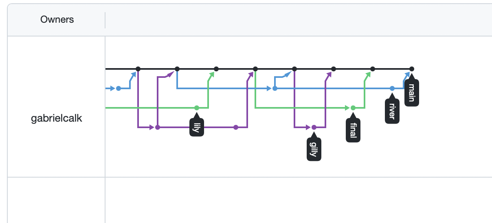
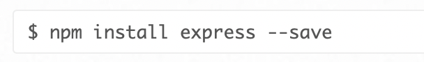
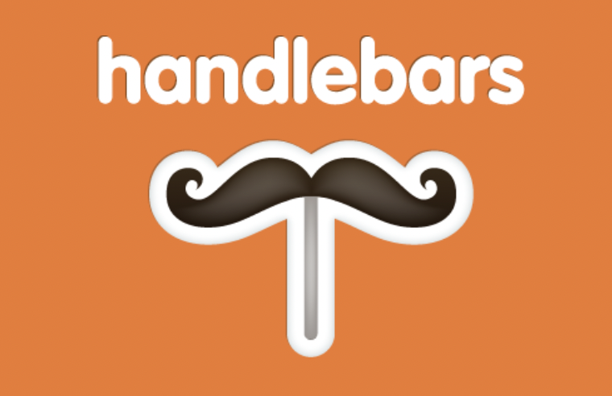
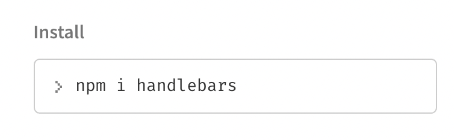
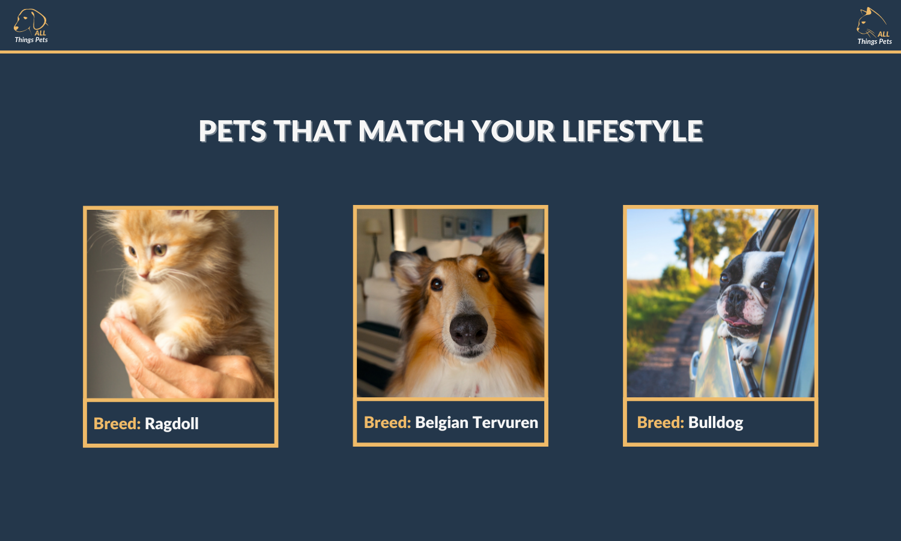
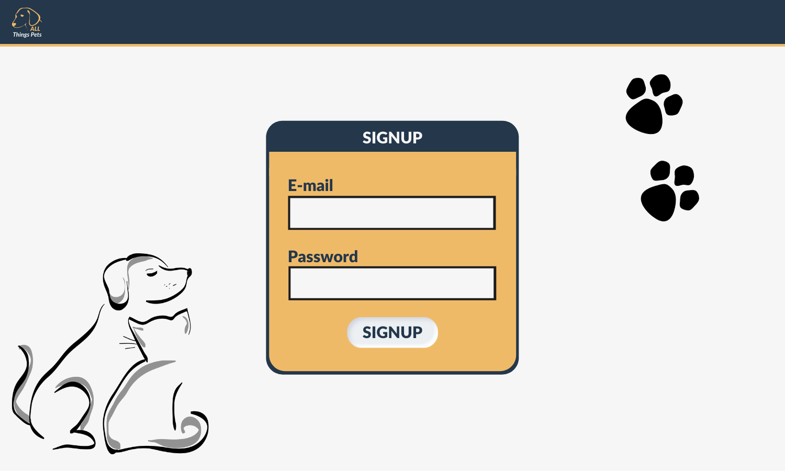
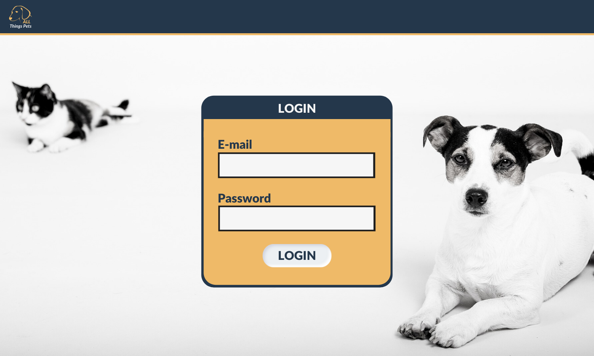

# All Things Pets

.png)

## Description

Covid-19 changed the way American's have lived their lives. In fact, pet adoptions increased by 30 to 40 percent in the year 2020 when compared to 2019. Unfortunately, by the following year, pet surrenders were up by 80%. Adopting a animal is a large responsibility that often times people are not prepared for. This application's purpose is to create a database on pet ownership and descriptions of various animals in order for the user to make a more informed decisions on future pet adoptions or integrating the user's pet into their daily activities.

<!-- [URL](undefined) -->

  ## Table of Contents
  
  * [Goals](#goals)
  * [Implementation](#implementation)
  * [Usage](#usage) 
  * [Installation](#installation)  
  * [Test](#test)
  * [Problems](#problems)
  * [Visualization](#visualization)
  * [Acknowledgements](#acknowledgements)
  * [Contributions](#contributions)
  * [Resources](#resources)
  * [License](#license)
  * [Contact](#contact)
  
## Goals

* Use Node.js and Express.js to create a RESTful API.

* Use Handlebars.js as the template engine.

* Use MySQL and the Sequelize ORM for the database.

* Have both GET and POST routes for retrieving and adding new data.

* Use at least one new library, package, or technology that we haven’t discussed.

* Have a folder structure that meets the MVC paradigm.

* Include authentication (express-session and cookies).

* Protect API keys and sensitive information with environment variables.

* Be deployed using Heroku (with data).

* Have a polished User Interface.

* Be responsive.

* Be interactive (i.e., accept and respond to user input).

* Meet good-quality coding standards (file structure, naming conventions, follows best practices for class/id naming conventions, indentation, quality comments, etc.).

* Have a professional README (with unique name, description, technologies used, screenshot, and link to deployed application).

## Implementation

* First, In order to implement development of creating a database of pets we utilized git branching. Git branching allows each programmer to work in a local branch. When the user pushes their work to the repository. The changes are peer reviewed to make sure that none of the upcoming changes will effect main branch. This also allows for user communication to see the progress of each user. If a change is submitted that will cause a merge conflict github will protect the main repository by making sure some changes are not committed. Github also allows issues to be assigned to other group members and allows others to assign tast so bugs can be worked and task are not being worked on in two different branches this helps to resolve any potential merge conflicts.
  
 

* Next, We installed the npm framework package of node and express.js. With express, we have a myriad of HTTP utility methods and middleware to create a RESTful API. When working with Express we are able to use Routing, Middleware and Request/Response. The methods we used in our project are app.get, app.use, req, and res to send information around the server.
  
 

* In order to connect our information to HTML we used Handlebars templating language. This allowed for fast design of the HTML page. Handlebars allows the web developer utilize the front end template to connect to the backend database. This gave us a spot to export our data onto the webpage that had been sequalized into mySQL.
  
 

* In order to connect to our database we used the npm package sequelize. This allowed us to seed our data into the sql table database. 

## Usage

  Build a db that is user friendly

## Installation
  
  npm i  

## Test

## Problems

  We weren't able to find a api that had the information we were looking for so we had to manually input each line of the database from pet websites in order to use the data we need to create the correct

## Visualization

Mockup choose your pet

Mockup pet questionaire
.png)

mockup questionaire
.png)

mock up sign up 

Mockup visualization for Login page

Mockup for pet friendly locations parks, restaurants and vets
.png)

Mockup for locations boarding and training
.png)

mockup 404 page

## Acknowledgements

## Contributions

## Resources
 
[Pet Adoption Increase during 2020](https://www.washingtonpost.com/dc-md-va/2021/01/06/animal-shelters-coronavirus-pandemic/)

[Pet Surrenders During 2021](https://www.nbcboston.com/news/clear-the-shelters/animals-adopted-during-pandemic-are-being-returned-to-shelters/2380084/)

[Eloquent Javascript](https://eloquentjavascript.net)
  
## License

Brent Graves, Huston "Fenix" Sampson, Meredith Coyne, and Gabriel Cavalcante Causin  Copyright 2021

  Permission is hereby granted, free of charge, to any person obtaining a copy of this software and associated documentation files (the "Software"), to deal in the Software without restriction, including without limitation the rights to use, copy, modify, merge, publish, distribute, sublicense, and/or sell copies of the Software, and to permit persons to whom the Software is furnished to do so, subject to the following conditions:
  
  The above copyright notice and this permission notice shall be included in all copies or substantial portions of the Software.
  
  THE SOFTWARE IS PROVIDED "AS IS", WITHOUT WARRANTY OF ANY KIND, EXPRESS OR IMPLIED, INCLUDING BUT NOT LIMITED TO THE WARRANTIES OF MERCHANTABILITY, FITNESS FOR A PARTICULAR PURPOSE AND NONINFRINGEMENT. IN NO EVENT SHALL THE AUTHORS OR COPYRIGHT HOLDERS BE LIABLE FOR ANY CLAIM, DAMAGES OR OTHER LIABILITY, WHETHER IN AN ACTION OF CONTRACT, TORT OR OTHERWISE, ARISING FROM, OUT OF OR IN CONNECTION WITH THE SOFTWARE OR THE USE OR OTHER DEALINGS IN THE SOFTWARE.

## Contact

* Brent Ryan Graves GitHub Username: grave019

* Link to Github Account [Brent Graves Repository](https://github.com/grave019)

* Email: brent.r.graves82@gmail.com

* Gabriel Cavalcante Causin Github Username: gabrielcalk

* Link to Github Account [Gabriel Cavalcante Causin Repository](https://github.com/gabrielcalk)

* Email: gabrielcalk@outlook.com

* Fenix Sampson Github Username: FenixS83

* Link to Github Account [Fenix Sampson Repository](https://github.com/FenixS83)

* Email: fenix.sampson@gmail.com

* Meredith Coyne Github Username: meredithcoyne

* Link to Github Account [Meredith Coyne Repository](https://github.com/meredithcoyne)

* meredithleigh.coyne@gmail.com